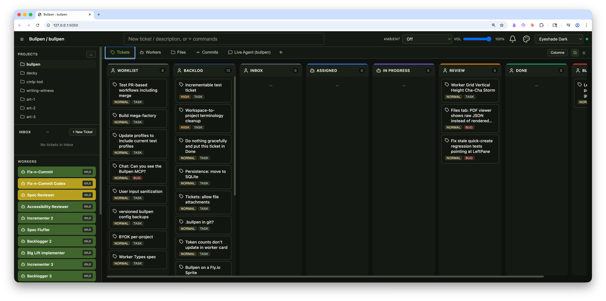
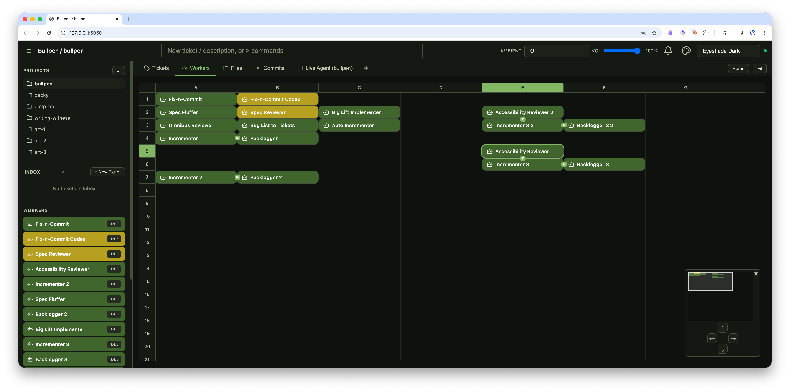
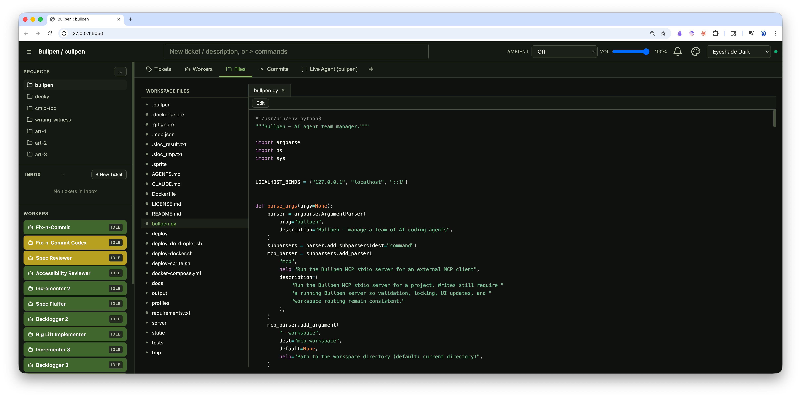
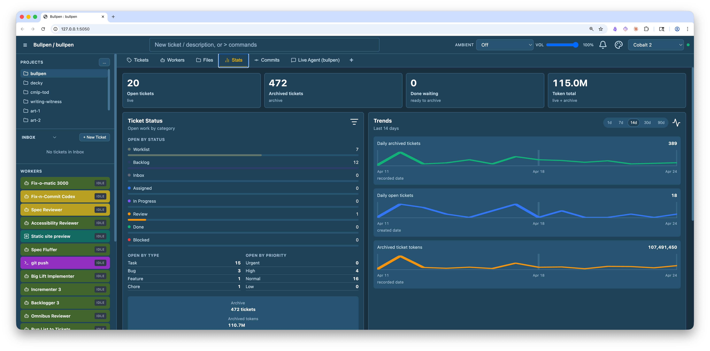
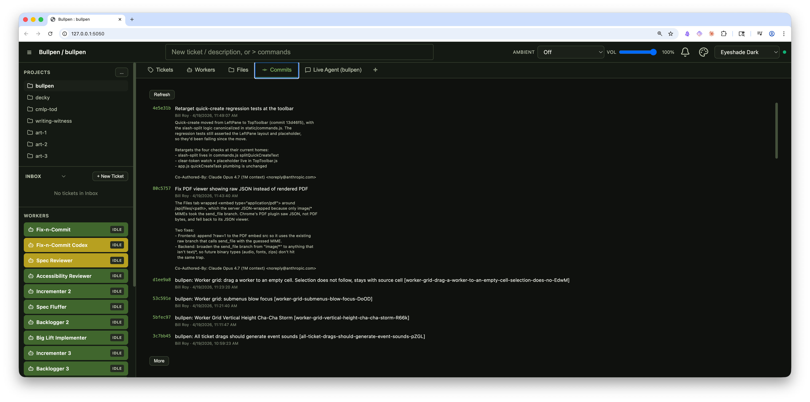
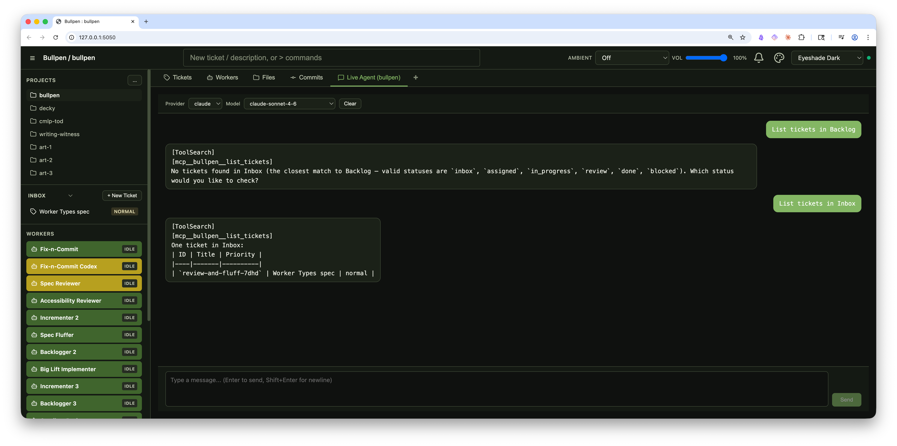

# Bullpen

An AI agent team manager. Configure workers on a grid, create task tickets, assign work, and let CLI agents (Claude, Codex, Gemini, OpenCode) execute autonomously with retry logic and real-time output streaming. Includes an MCP server so supported agents can manage tickets directly from the conversation.

## Screenshots

### Tickets


### Workers


### Files


### Stats


### Commits


### Live Agent


## Quick Start

```bash
pip install -r requirements.txt
python3 bullpen.py --workspace /path/to/your/project
```

This opens a browser at `http://localhost:5000`. The workspace directory is where your agents will operate.

### AI CLI Prerequisites

Bullpen runs provider CLIs locally. Install and authenticate each provider you want to use:

- **Claude Code CLI**
  - Install/setup: https://code.claude.com/docs/en/setup
  - Authentication: https://code.claude.com/docs/en/authentication
- **Codex CLI**
  - Installation: https://github.com/openai/codex/blob/main/docs/install.md
  - Authentication: https://github.com/openai/codex/blob/main/docs/authentication.md
- **Gemini CLI**
  - Installation: https://github.com/google-gemini/gemini-cli/blob/main/docs/get-started/index.md
  - Authentication: https://github.com/google-gemini/gemini-cli/blob/main/docs/get-started/authentication.md
- **OpenCode CLI**
  - Installation: `npm install -g opencode-ai`
  - Authentication: `opencode auth login` or provider environment variables supported by OpenCode

Only authenticated providers are usable in Bullpen. Complete login/auth setup in each provider CLI you plan to use first.

If a CLI is installed in a non-standard location, you can point Bullpen to explicit executables:

- `BULLPEN_CLAUDE_PATH`
- `BULLPEN_CODEX_PATH`
- `BULLPEN_GEMINI_PATH`
- `BULLPEN_OPENCODE_PATH`

### Options

| Flag | Default | Description |
|------|---------|-------------|
| `--workspace` | current directory | Project directory for agents to work in |
| `--port` | `$PORT` or `5000` | Server port (`PORT` env var is respected for Sprite/hosted deploys) |
| `--host` | 127.0.0.1 | Bind address (network-exposed binds require auth to be enabled) |
| `--no-browser` | off | Don't auto-open the browser |
| `--websocket-debug` / `--no-websocket-debug` | off | Enable/disable Socket.IO and Engine.IO packet/activity logging |
| `--set-password [USERNAME]` | — | Interactively set/update user passwords (repeatable for multiple users); can be combined with `--delete-user`; exits after applying changes |
| `--delete-user USERNAME` | — | Remove configured login users (repeatable); can be combined with `--set-password`; exits after applying changes |
| `--bootstrap-credentials` | off | Create initial credentials from `BULLPEN_BOOTSTRAP_USER` (default `admin`) and `BULLPEN_BOOTSTRAP_PASSWORD`, then exit (idempotent if users already exist) |

By default the server only accepts connections from localhost. Socket.IO accepts same-origin, localhost, and trusted tunnel origins (including `*.ngrok*` and `*.sprites.app`) so reverse proxies and tunneled URLs work without wildcard CORS; authentication remains the primary access control.
If you bind to a non-loopback host (for example `0.0.0.0`), Bullpen requires authentication credentials to be configured first.
For production/TLS deployments (including Sprites), set `BULLPEN_PRODUCTION=1` so secure cookies and forwarded-proxy headers are handled correctly.

## Features

- **Kanban board** -- drag-and-drop ticket management with user-configurable columns (add, remove, rename, reorder); drag tickets between columns or onto workers
- **List view** -- switchable list view for the Tickets tab with sortable columns, full-text search, priority/status/type filters, timestamped Created column, and token-consumption display
- **Worker grid** -- configurable grid of AI agent slots; drag tickets onto workers to assign them
- **Worker grid selection** -- select multiple workers, move or delete groups, and use scoped context-menu actions for one worker, a pass-connected group, or the explicit selection
- **Agent execution** -- workers invoke Claude, Codex, Gemini, or OpenCode CLI tools in subprocesses with prompt assembly, retry on failure, and real-time output streaming (structured stream parsing for Claude/Codex/OpenCode)
- **Shell / Script workers** -- run a configured shell command against a ticket, pass ticket data as JSON/env/argv, capture output, and route or update the ticket from script output
- **Service workers** -- supervise long-running workspace processes, stream logs, run health checks, and accept ticket-triggered start/restart orders
- **Marker workers** -- place no-op marker cards on the worker grid for labels, navigation targets, and pass-through routing
- **Worker Focus Mode** -- click a running worker to see live agent output streamed in real time
- **Live Agent Chat** -- interactive chat tabs for Claude, Codex, Gemini, and OpenCode with provider/model selectors, streaming responses, add/close chat sessions, stop button, and automatic chat logging to tickets
- **Web terminal tabs** -- open one or more PTY-backed terminal tabs rooted in the active workspace directory, with xterm.js rendering, resize support, restart/close controls, and cleanup on browser disconnect
- **File browser & editor** -- browse workspace files (including `.bullpen/`) with syntax highlighting, markdown preview with source-mode syntax highlighting, image/PDF viewing, HTML sandbox preview, file downloads, and an in-browser editor with find/replace; clicking `.html` files opens them in the default browser
- **Commits tab** -- browse the git commit log for the workspace with full commit descriptions
- **Commit diff viewer** -- click a commit row to open its full patch in a modal
- **Multi-project** -- register multiple project directories, switch between them, with per-workspace state and activity badges; clone new projects directly from a Git URL via the Projects menu
- **Inter-project worker transfer** -- copy or move individual workers or selected worker groups (optionally with profile copy) between registered workspaces
- **Scheduling** -- workers can activate on a time schedule (at a specific time, or on an interval) or on queue events; pause/unpause individual workers
- **Priority-aware queues** -- worker queues and watched-column claims prefer higher-priority tickets while preserving stable ordering within a priority
- **Auto-commit & auto-PR** -- optionally commit agent output on success and open a pull request automatically
- **Worktrees** -- agents can work in isolated git worktrees per task to avoid conflicts
- **Worker handoff** -- chain workers by setting disposition to route completed tasks to the next worker
- **Profiles** -- 25 built-in worker profiles (feature-architect, code-reviewer, test-writer, unconfigured-worker, etc.) with customizable expertise prompts; create custom profiles
- **Teams** -- save and restore grid configurations
- **Resizable left pane** -- drag the left pane width while preserving touch scrolling on iPad-style devices
- **Ticket editing** -- edit ticket title, tags, and description inline; Cmd+Enter to save
- **Stats tab** -- aggregated token usage and provider/model breakdowns in a dedicated dashboard view
- **Token tracking** -- per-ticket token consumption tracking plus provider/model usage metadata, displayed in list view and ticket details
- **Worker roster queue count** -- left-pane worker roster shows queued workload while workers are in `WORKING` state
- **Ambient sounds** -- 18 synthesized ambient soundscapes (Server Room, Forest Rain, Deep Space, War Room, etc.) generated via the Web Audio API with per-workspace volume control
- **Light/dark theme** -- toggle between dark and light themes
- **Context menu** -- right-click worker cards for scoped actions: this worker, connected group, or selected workers
- **Real-time sync** -- Socket.IO keeps all connected clients in sync, scoped per workspace, with origin checks that allow localhost/same-origin and trusted tunnel domains (including `.sprites.app`)
- **Persistence** -- tickets stored as frontmatter markdown files in `.bullpen/tasks/`, layout and config as JSON
- **Ticket archiving** -- archive completed tickets to keep the board clean
- **Authentication** -- optional local username/password login (supports multiple users; see [Authentication](#authentication) below)
- **Logout** -- sign out from the top-left menu when authentication is enabled
- **Deployment label** -- Docker and Microsandbox runs can show the active container or sandbox name in the top toolbar
- **MCP server** -- expose ticket management tools to supported agents via JSON-RPC stdio (see [MCP Integration](#mcp-integration) below)
- **Cross-platform** -- runs on macOS, Linux, and Windows

## Deployment Notes

- **Sprite/tunnel origin trust** -- Socket.IO origin checks include trusted tunnel suffixes including `.sprites.app` for Fly.io Sprite URLs.
- **Sprite service port compatibility** -- Bullpen supports `PORT` env var fallback so hosted runtimes that expect port `8080` work without custom patching.
- **Production TLS mode** -- setting `BULLPEN_PRODUCTION=1` enables secure session cookies and proxy header handling for HTTPS deployments.
- **Docker dual-port deploy** -- run Bullpen and the in-container app with separate published ports (see [docs/docker.md](docs/docker.md)).
- **Microsandbox local isolation** -- run Bullpen, agents, and project commands inside a Microsandbox microVM with the workspace mounted at `/workspace` (see [Microsandbox Deployment](#microsandbox-deployment)).
- **One-command Sprite install** -- `deploy-sprite.sh` automates Sprite provisioning, auth bootstrap, service creation, and URL publication.
- **DigitalOcean Droplet runbook** -- `docs/digitalocean-droplet.md` provides nginx + `systemd` + TLS + firewall setup, plus checked-in templates under `deploy/digitalocean/`.

## Architecture

- **Backend**: Flask + Flask-SocketIO (threading async mode)
- **Frontend**: Vue 3 via CDN (no build step, no npm)
- **Transport**: Socket.IO for real-time events, REST for file serving
- **Storage**: flat files in `.bullpen/` under the workspace
- **MCP**: stdio JSON-RPC server for agent ticket-tool integration

```
bullpen.py              # Main app entry point
deploy-sandbox.py       # Microsandbox deploy, base setup, and maintenance helper
deploy/microsandbox/    # Microsandbox support files
server/
  app.py                # Flask app factory, routes, startup reconciliation
  auth.py               # Optional multi-user authentication
  events.py             # Socket.IO event handlers (write-locked)
  tasks.py              # Task CRUD, slug generation, fractional indexing
  workers.py            # Worker state machine, subprocess execution, auto-commit/PR
  service_worker.py     # Long-running service worker supervision
  terminal.py           # PTY-backed web terminal session manager
  persistence.py        # Atomic writes, custom frontmatter parser
  validation.py         # Input validation and sanitization
  profiles.py           # Profile management
  teams.py              # Team save/load
  scheduler.py          # Time-based and interval-based worker activation
  workspace_manager.py  # Multi-project registry and workspace state
  mcp_tools.py          # MCP stdio server (JSON-RPC ticket tools)
  agents/               # Agent adapter layer (Claude, Codex, Gemini)
static/
  index.html            # CDN script tags with SRI (Vue 3, Socket.IO, Prism, markdown-it)
  login.html            # Login page (served publicly when auth is enabled)
  app.js                # Vue app setup, state management
  style.css             # Light/dark theme
  components/           # Vue components (KanbanTab, WorkerCard, FilesTab, LiveAgentChatTab, TerminalTab, etc.)
profiles/               # 25 built-in worker profile JSON files
tests/                  # 934 collected pytest tests
```

## How It Works

1. **Create tickets** in the Inbox via the left pane quick-create input or the Kanban board
2. **Add workers** to the grid by clicking empty slots and selecting a profile
3. **Assign tickets** by dragging them from the Inbox onto a worker card, or queue multiple tickets
4. **Start the worker** -- it assembles a prompt (workspace context + expertise + ticket body), invokes the CLI agent, and streams output in real time
5. **Monitor progress** -- click a running worker to open the Focus View with live agent output
6. **On completion**, the worker optionally auto-commits, opens a PR, and routes the ticket based on its disposition (Review, Done, or hand off to another worker)
7. **On failure**, the worker retries with backoff, then moves the ticket to Blocked
8. **Scheduled workers** can activate on a timer (specific time or interval) to process queued tickets or create their own ephemeral tickets
9. **Chat directly** with Claude, Codex, or Gemini via the Live Agent Chat tab, with conversations logged to tickets
10. **Open additional chat tabs** as needed to run parallel conversations with separate session histories
11. **Open terminal tabs** when you need direct shell access in the active workspace without leaving Bullpen

## Web Terminal Tabs

Click the terminal icon in the tab bar to open a shell rooted at the active
workspace directory. Each terminal tab is an independent PTY-backed shell
session, so you can keep multiple terminals open per workspace and switch among
them like other Bullpen tabs.

Terminal sessions run as the same local user that started Bullpen. Closing a
running terminal prompts before stopping its shell, and browser disconnects clean
up active terminal processes. The terminal is intended for trusted local or
authenticated deployments; exposing Bullpen to a network also exposes shell
access to authenticated browser users.

The terminal frontend uses xterm.js from a CDN and the backend bridges PTY
input/output over the existing Socket.IO connection. Terminal transcripts are
not persisted to `.bullpen/`.

## Value Workers

Value workers are editable data cells on the worker grid. They occupy normal
grid cells, can be moved/copied/duplicated like other workers, and can be
referenced by spreadsheet-style coordinates such as `A1` or by their optional
name. They do not run, queue tickets, watch columns, or receive ticket drops.

Use Value workers for small pieces of shared workflow state such as branch
names, counters, thresholds, or labels. Supported workers can interpolate them
with `{A1}` or `{value name}` in configured fields. Shell and Service
interpolation is raw text substitution, so quote values yourself when the
rendered command needs shell-safe syntax.

## Shell / Script Workers

Shell workers, also shown as script-style workers in some workflows, run one
configured shell command against one ticket. Bullpen passes ticket data into the
command, captures stdout/stderr, then uses the command's exit code and optional
stdout JSON to decide what happens next.

### Passing ticket data to a script

Set **Pass ticket as** in the worker configuration.

**`stdin-json`** is the default and usually the best choice. Bullpen writes one
JSON object to stdin:

```json
{
  "id": "ticket-id",
  "title": "Ticket title",
  "filename": "ticket-id.md",
  "project": "/path/to/workspace",
  "status": "assigned",
  "type": "task",
  "priority": "normal",
  "tags": [],
  "body": "ticket body markdown",
  "history": [],
  "worker": {
    "name": "Script worker",
    "slot_index": 3,
    "coord": {"row": 0, "col": 3}
  }
}
```

Example:

```bash
jq -r '.title' >/tmp/ticket-title.txt
```

**`env-vars`** exposes scalar ticket fields as environment variables:

```text
BULLPEN_TICKET_ID
BULLPEN_TICKET_TITLE
BULLPEN_TICKET_FILENAME
BULLPEN_PROJECT
BULLPEN_TICKET_STATUS
BULLPEN_TICKET_PRIORITY
BULLPEN_TICKET_TAGS
BULLPEN_TICKET_BODY_FILE
```

`BULLPEN_TICKET_TAGS` is a JSON array string. The ticket body is written to a
temporary file, and `BULLPEN_TICKET_BODY_FILE` points to it.

Example:

```bash
grep -q "security" "$BULLPEN_TICKET_BODY_FILE"
```

**`argv-json`** passes the same ticket JSON as a command-line argument. This is
handy for small payloads, but operating systems have command-line length limits.
If the payload is too large, Bullpen falls back to `stdin-json`.

### Controlling the result

The script's exit code is the primary signal:

| Exit code | Result |
|-----------|--------|
| `0` | Success. Bullpen uses the worker's configured Output route unless stdout JSON overrides it. |
| `78` | Intentional block. The ticket moves to Blocked without retry. |
| Any other nonzero code | Error. Bullpen retries according to Max Retries, then moves the ticket to Blocked. |
| Timeout | Error with reason `timeout`; retries according to Max Retries, then Blocked. |

If the command exits `0` and prints nothing, Bullpen uses the worker's configured
Output route. For example, this command succeeds and follows the default route:

```bash
true
```

On success, stdout may be a JSON object:

```json
{
  "disposition": "review",
  "reason": "optional note",
  "ticket_updates": {
    "title": "New title",
    "priority": "high",
    "tags": ["demo"],
    "body_append": "Text appended to the ticket body"
  }
}
```

Supported `disposition` values include:

```text
review
done
blocked
worker:Worker Name
pass:left
pass:right
pass:up
pass:down
pass:random
random:
random:Worker Name
```

If `disposition` is omitted, Bullpen uses the worker's configured Output route.
Script output can directly update these ticket fields:

```text
title
priority
tags
body_append
```

Status changes go through `disposition`; stdout JSON cannot set `status`
directly. It also cannot replace the whole ticket body or set arbitrary
frontmatter keys.

Examples:

```bash
# Default route, no ticket changes.
true
```

```bash
# Block intentionally.
jq -n '{"disposition":"blocked","reason":"Demo block"}'
```

```bash
# Append text and use the configured Output route.
jq -n '{"ticket_updates":{"body_append":"Script worker touched this ticket."}}'
```

```bash
# Change priority and pass right.
jq -n '{"disposition":"pass:right","ticket_updates":{"priority":"high"}}'
```

For updates outside the stdout contract, use the server-backed ticket CLI from
inside the script instead of editing `.bullpen/tasks/*.md` directly:

```bash
python3 bullpen.py ticket --workspace "$BULLPEN_PROJECT" update \
  --id "$BULLPEN_TICKET_ID" \
  --body "new body"
```

Direct writes under `.bullpen/tasks` bypass Bullpen's running Flask/Socket.IO
server, so browser boards will not receive normal live update events.
For larger payloads, the ticket CLI also supports `--description-file` on
`create` and `--body-file` on `update`.

## Supported Agents

| Agent | CLI Tool | Notes |
|-------|----------|-------|
| Claude | `claude` | Real-time streaming via stream-json |
| Codex | `codex` | GPT-5 family models, stderr streaming |
| Gemini | `gemini` | Gemini CLI prompt execution with stdout streaming, MCP ticket tools, and conservative Flash defaults |
| OpenCode | `opencode` | Catalog-backed `provider/model` selection, JSON streaming, MCP ticket tools |

Each agent CLI must be installed, available on your PATH, and authenticated with its provider before Bullpen can use it.

## Authentication

Bullpen supports optional local username/password authentication. Multiple users can be configured in the global `.env` file. When no credentials are configured, Bullpen runs wide-open with no login screen — ideal for localhost development.

### Enabling auth

```bash
python3 bullpen.py --set-password admin
python3 bullpen.py --set-password alice --set-password bob
```

You will be prompted for a password (and username if omitted). Credentials are written as password hashes to `~/.bullpen/.env` (mode 600). Restart the server to apply. On startup Bullpen prints:

```
Bullpen auth: ENABLED (2 user(s), primary=admin)

Network-exposed binds (for example `--host 0.0.0.0`) are only allowed when auth is enabled.
```

To delete users:

```bash
python3 bullpen.py --delete-user alice
python3 bullpen.py --delete-user alice --delete-user bob
python3 bullpen.py --set-password admin --delete-user old-admin
```

When auth is enabled, unauthenticated browser requests are redirected to `/login`, XHR requests receive a 401, and Socket.IO connections without a valid session are rejected. Static assets needed by the login page (`login.html`, `style.css`, `favicon.ico`) remain public.

Successful logins are persistent browser sessions. The default lifetime is 30 days; set `BULLPEN_SESSION_DAYS` to change it (bounded to 1-365 days). Server restarts do not force a new login as long as `~/.bullpen/.env` keeps the same `BULLPEN_SECRET_KEY`.

### Disabling auth

Delete `~/.bullpen/.env` and restart. Bullpen will report auth disabled and all routes become open again.

### Deploying remotely

When exposing Bullpen outside localhost, put TLS in front (nginx, Caddy, Cloudflare Tunnel, etc.) so the session cookie is never transmitted in plaintext. See [docs/login.md](docs/login.md) for full details on CSRF protection, cookie settings, and the env file format.

For a full single-host production baseline on Ubuntu, see [docs/digitalocean-droplet.md](docs/digitalocean-droplet.md).

## DigitalOcean Droplet Deployment

For a full Droplet guide, use:

- [docs/digitalocean-droplet.md](docs/digitalocean-droplet.md)
- `deploy/digitalocean/bullpen.service` (systemd template)
- `deploy/digitalocean/nginx-bullpen.conf` (reverse proxy template)
- `deploy-do-droplet.sh` (optional bootstrap automation)

## Docker Deployment

For containerized deploys with separate Bullpen/app port mappings, use:

- [docs/docker.md](docs/docker.md)
- `Dockerfile`
- `docker-compose.yml` (includes optional advanced two-container profile)

## Microsandbox Deployment

Microsandbox is the preferred local isolation path when you want Bullpen, AI
agent CLIs, shell workers, and project commands to run inside a microVM instead
of directly on the host. The selected host project is mounted into the sandbox
as `/workspace/<project-name>`, the `/workspace` root itself is sandbox-owned
storage, the persistent sandbox home is mounted as `/home/bullpen`, and the
Bullpen UI is exposed on localhost only. This keeps `/workspace` writable for
multiple apps under test without exposing the host directory that contains the
selected project. Projects cloned or created at sibling paths such as
`/workspace/busy-deck` live inside the sandbox, while `/app` remains the
read-only Bullpen source checkout.

Install the Microsandbox Python package on the host first:

```bash
python3 -m pip install microsandbox
```

Microsandbox deploy uses one Python entrypoint. On first run, the script creates
the reusable local base snapshot if it is missing, then starts Bullpen for the
project. The base contains Python dependencies, Node.js/npm, Git, GitHub CLI,
ripgrep, and the Claude, Codex, Gemini, and OpenCode CLIs.

```bash
python3 deploy-sandbox.py --workspace-root /path/to/projects
```

To prepare or rebuild the reusable base without starting Bullpen:

```bash
python3 deploy-sandbox.py --prepare-base
```

During the run step, Bullpen prompts for the admin password if
`--admin-password` is omitted. Provider setup is intentionally sandbox-native:
Claude, Codex, OpenCode, and GitHub login flows run inside the VM as the
`bullpen` user and persist under `/home/bullpen`.

### Microsandbox options

| Option | Default | Description |
|--------|---------|-------------|
| `--sandbox-name NAME` | `bullpen` | Microsandbox instance name |
| `--workspace-root PATH` | required | Host directory containing projects, mounted as `/workspace` |
| `--bullpen-port PORT` | `8080` | Host and guest Bullpen UI port |
| `--app-port PORT` | `3000` | Host and guest app preview port exposed for project commands |
| `--admin-user USER` | `admin` | Bullpen login user to bootstrap inside the sandbox |
| `--admin-password PASSWORD` | prompt | Bullpen login password; prompted and confirmed when omitted |
| `--base NAME` | `bullpen-microsandbox-local` | Prepared Microsandbox base snapshot |
| `--source-image IMAGE` | `node:22-bookworm` | OCI source image used when preparing the base |
| `--prepare-base` | off | Prepare the reusable base and exit |
| `--rebuild-base` | off | Rebuild the reusable base before continuing |
| `--no-prepare-base` | off | Fail instead of preparing a missing base |
| `--sandbox-home PATH` | `~/.bullpen/microsandbox-home` | Persistent sandbox home for provider auth, Bullpen config, and logs |
| `--vcpus N` | `4` | Virtual CPUs for the sandbox |
| `--memory-mib N` | `4096` | Sandbox memory in MiB |
| `--host-nofile N` | `12000` | Target host process `RLIMIT_NOFILE` before the Microsandbox runtime is created |
| `--guest-nofile N` | `65536` | Target `RLIMIT_NOFILE` for the in-sandbox `bullpen` user |
| `--network-max-connections N` | `8192` | Microsandbox network connection tracker cap |
| `--replace` | off | Replace an existing sandbox without prompting |
| `--no-replace` | off | Abort if a sandbox with the same name already exists |
| `--open` / `--no-open` | open | Open or suppress opening the Bullpen UI in a host browser |

The deployer logs these effective Microsandbox limits at startup. The defaults
come from the May 25, 2026 investigation runs: low host `nofile` produced
host-side `EMFILE` through the Microsandbox filesystem layer, while the SDK's
default network cap of 256 produced intermittent global outbound connect
failures under Bullpen worker load.

Additional maintenance commands:

```bash
python3 deploy-sandbox.py auth claude
python3 deploy-sandbox.py auth codex
python3 deploy-sandbox.py auth opencode
python3 deploy-sandbox.py auth git
python3 deploy-sandbox.py test-provider claude
python3 deploy-sandbox.py test-provider codex
python3 deploy-sandbox.py test-provider opencode
python3 deploy-sandbox.py test-provider git
python3 deploy-sandbox.py first-light claude
```

See [docs/microsandbox.md](docs/microsandbox.md) for implementation details,
known auth behavior, and troubleshooting notes.

## MCP Integration

Bullpen ships an MCP (Model Context Protocol) stdio server that lets supported agent sessions manage tickets directly from the conversation. The server exposes tools for creating, listing, and updating tickets.

### Available MCP tools

| Tool | Description |
|------|-------------|
| `create_ticket` | Create a new ticket with title, description, tags, and status |
| `list_tickets` | List tickets, optionally filtered by status |
| `list_tasks` | Alias for `list_tickets` |
| `list_tickets_by_title` | List tickets by approximate title match |
| `update_ticket` | Update a ticket's status, title, or description |
| `get_value` | Read a Value worker by coordinate or name |
| `set_value` | Update an existing Value worker |
| `increment_value` | Atomically add to a numeric Value worker |
| `decrement_value` | Atomically subtract from a numeric Value worker |
| `list_values` | List Value workers in grid order |

### How it works

Claude, Codex, Gemini, and OpenCode adapters spawn `server/mcp_tools.py` as a child process and communicate via stdin/stdout JSON-RPC 2.0 with `Content-Length` framing. The MCP server connects to the running Bullpen instance via Socket.IO to perform ticket operations.

When auth is enabled, the MCP server authenticates using a shared token that Bullpen writes to `~/.bullpen/secrets.json` on startup, keyed per project, while keeping runtime host/port metadata in each workspace's `.bullpen/config.json`.

### Caveats

The MCP server communicates exclusively over stdout. Any stray `print()` call or stdout write from a dependency will corrupt the JSON-RPC framing. Debug output must go to `sys.stderr`.

### Shell Agent Fallback

Codex sessions or other shell-based agents may not always receive native MCP
tools from their host. For those sessions, use the server-backed ticket CLI
instead of writing `.bullpen/tasks` files directly:

```bash
python3 bullpen.py ticket --workspace /path/to/project create \
  --title "Ticket title" \
  --status review \
  --description "Markdown description"
```

```bash
python3 bullpen.py ticket --workspace /path/to/project update \
  --id ticket-id \
  --status review
```

The ticket CLI uses the same Socket.IO-backed write path as the MCP tools, so
the browser receives live board updates.

## Running Tests

```bash
pip install -r requirements.txt
python3 -m pytest tests/
```

## License

This project is licensed under the MIT License. See `LICENSE.md`.

## Fly.io Sprite Deployment (Experimental)

Use the one-command deploy script:

```bash
curl -sL https://raw.githubusercontent.com/billroy/bullpen/main/deploy-sprite.sh | bash
```

The script prompts for Sprite name, admin username/password, then:
- Creates (or reuses) the Sprite
- Clones/updates Bullpen and installs requirements
- Ensures `node` and `rg` (ripgrep) are installed on the Sprite
- Bootstraps Bullpen credentials non-interactively
- Configures production mode (`BULLPEN_PRODUCTION=1`)
- Creates a background service on port `8080`
- Makes the Sprite URL public and prints the actual HTTPS URL
- Performs a short health check before exiting

See detailed deployment docs:
- `docs/sprite.md` (one-command deploy flow and implementation notes)
- `docs/fly-config.md` (Sprite architecture, hibernation behavior, production details)
